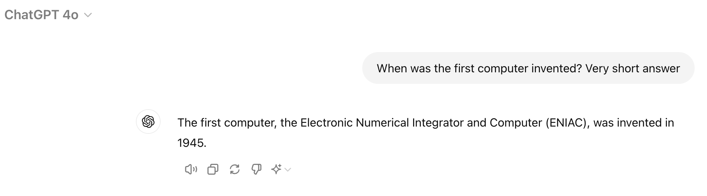
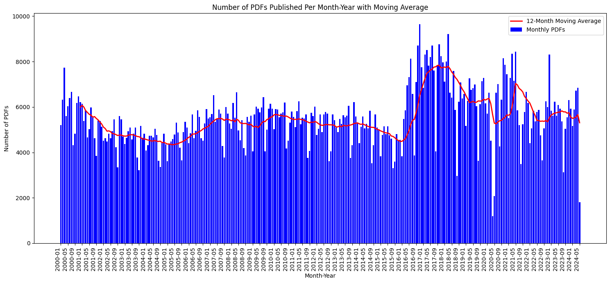
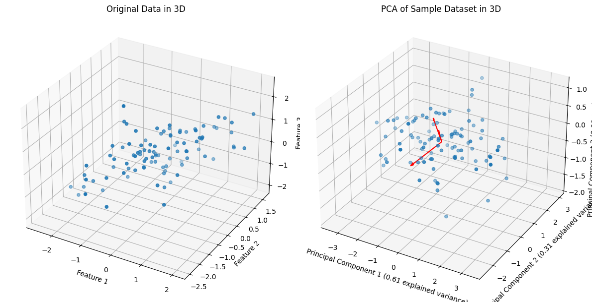
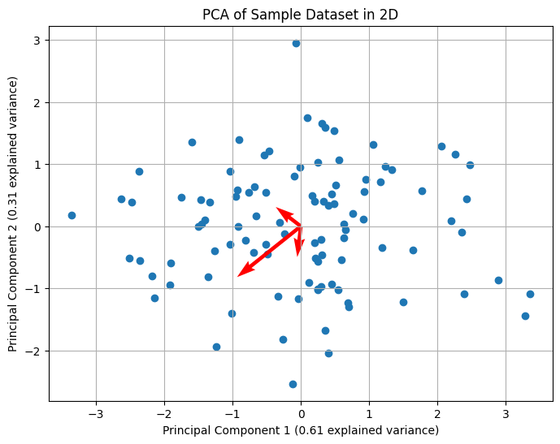

---
header-includes:
  - \usepackage{amsmath}
  - \usepackage{amsfonts}
  - \usepackage{amssymb}
  - \usepackage{enumitem}
---


# Introduction

Since the invention of the computer in 1945, we have needed to translate our thoughts into machine instructions. To solve a problem requiring a computer, we must first find the solution and then translate this solution into "machine language." In order to overcome this difficulty, a wide range of programming languages have been developed in the last decade. Below, you can find a table with the different categories of programming languages along with some examples, classified subjectively into different levels of proximity to human language (Very Low, Low, Moderate, Moderate to High, High, Very High).
| Category                        | Example             | Proximity to Human Language |
|---------------------------------|---------------------|-----------------------------|
| Machine Languages               | Binary code         | Very Low                    |
| Assembly Languages              | x86 Assembly        | Low                         |
| Low-Level Programming Languages | C, C++              | Moderate                    |
| High-Level Programming Languages| Python, Java        | High                        |
| Very High-Level Programming Languages | SQL, MATLAB  | Very High                   |
| Scripting Languages             | JavaScript, PHP     | High                        |
| Markup Languages                | HTML, XML           | Moderate to High            |
| Natural Language Programming    | Inform 7            | Very High                   |

  

So, could a machine understand natural language? This is the purpose of a branch of Machine Learning known as Natural Language Processing (NLP). NLP aims to minimize, even eliminate, the friction between humans and computers. In words of the current Nvidia CEO Jensen Huang: "It is our job to create computing technology such that nobody has to program, and that the programming language is human. Everybody in the world is now a programmer. This is the miracle of Artificial Intelligence."
This is a strong and groundbreaking statement with which I partially agree. Although I personally think that the role of Natural Language in this context might be overestimated. The programmer's purpose nowadays is not only to translate algorithms to machine language but also to actually come up with these algorithms and sometimes, natural language is not sufficient to express very complex ideas, which is why mathematics has its own language.

## Data Extraction
One of the common tasks that it has gained relevance in the last decade is data extraction. In the time of Big Data, Data Analysis and Data Science extracting data from literally anywhere is crucial. NLP provides a new tool to extract data which requires some understanding of Human Language.

In this bachelor's thesis, we will use NLP to extract data from the Boletín Oficial del Estado, which is the official gazette of Spain. The number of pdfs published per month make incredibly difficult for an only person to keep up with all the information (see graph below). LLMs combined with a RAG system can very useful to retrieve information so it can enhance transparency and accessibility to information. What is more, [it is already being used in law firms](https://www.truelaw.ai/blog/legal-rag-vs-rag-a-technical-exploration-of-retrieval-systems)

Image in https://github.com/danmorper/NLP/blob/main/boe/xml.ipynb
# What is the Boletín Oficial del Estado (BOE)?
The Boletín Oficial del Estado (BOE) is the official gazette of Spain, functioning as a daily publication that serves as the official channel for disseminating legal norms, regulations, and other important official announcements from the government and other public bodies. The BOE is published every day and made available in both PDF and XML formats. This allows for easy access and verification of legal documents by citizens, organizations, and legal entities.

Here is a general schema of how BOE XML files are structured:
## Structure of BOE XML Files

```lua
Sumario
|
|-- Meta
|   |-- pub
|   |-- ano
|   |-- fecha
|   |-- fechaInv
|   |-- fechaAnt
|   |-- fechaAntAnt
|   |-- fechaSig
|   |-- fechaPub
|   |-- pubDate
|
|-- diario (nbo)
|   |-- sumario_nbo (id)
|   |   |-- urlPdf (szBytes, szKBytes)
|   |
|   |-- seccion (num, nombre)
|       |-- departamento (nombre, etq)
|           |-- item (id)
|               |-- urlPdf
|               |-- urlHtm
|               |-- urlXml
```

- **sumario**
    - **meta**
    - **pub**: Publication identifier (e.g., "BOE")
    - **anno**: Year of publication
    - **fecha**: Publication date in DD/MM/YYYY format
    - **fechaInv**: Inverted publication date in YYYY/MM/DD format
    - **fechaAnt**: Previous publication date
    - **fechaAntAnt**: Date before the previous publication
    - **fechaSig**: Next publication date
    - **fechaPub**: Human-readable publication date
    - **pubDate**: RFC 822 formatted publication date
    - **diario** (with attribute `nbo` for the issue number)
        - **sumario_nbo** (with attribute `id` for summary identifier)
            - **urlPdf**: URL to the PDF file
        - **seccion** (with attributes `num` for section number and `nombre` for section name)
            - **departamento** (with attributes `nombre` for department name and `etq` for department code)
                - **item** (with attribute `id` for item identifier)
                    - **titulo**: Title of the item
                    - **urlPdf**: URL to the item's PDF file (with attributes `szBytes`, `szKBytes`, and `numPag` for number of pages)
                    - **urlHtm**: URL to the item's HTML version
                    - **urlXml**: URL to the item's XML version

# Principal Component Analysis (PCA)
Principal Component Analysis (PCA) is a statistical technique used to reduce the dimensionality of a dataset while retaining most of its variability.

Let $X$ be the sample matrix, where $x_1, \ldots, x_n$ are the samples.
$$
X = \begin{pmatrix} 
x_{1.} \\ 
\vdots \\ 
x_{n.}
\end{pmatrix} 
\quad \implies \quad 
X \in \mathbb{R}^{n \times p} 
$$

The only assumption on $X$ is that its mean vector and covariance matrix exist.

Let $\delta = (\delta_1, \ldots, \delta_p)'$ be called the weighting vector. Then the weighted average is:
$$
\delta' X = \sum_{j=1}^{p} \delta_j X_j \quad \text{such that} \quad \sum_{j=1}^{p} \delta_j = 1 
$$

In order to properly choose $\delta$, we will maximize the variance:
$$
\max_{\delta \in M} \text{Var}(\delta' X) = \max_{\delta \in M} \delta' \text{Var}(X) \delta 
$$
$$
M = \{\delta : \|\delta\| = 1\}
$$

We call $\Sigma = \text{Var}(X)$.

$$
\max_{\delta \in M} \delta' \Sigma \delta 
$$

This is a quadratic convex maximization problem with nonlinear constraints.

$$
\mathcal{L} (\delta, \lambda) = \delta' \Sigma \delta - \lambda (\delta' \delta - 1) 
$$

- $\nabla_{\delta} \mathcal{L} = 0 : \Sigma \delta = \lambda \delta$

- $\lambda$: eigenvalue 
- $\delta$: eigenvector of $\lambda$
- $\delta' \Sigma \delta = \lambda \delta' \delta = \lambda$


Thus,
$$
\max_{\delta} \lambda \quad \text{subject to} \quad \Sigma \delta = \lambda \delta, \|\delta\| = 1 
$$
So we call $\delta$ the first principal component.

Let $\delta^1, \ldots, \delta^j$ fit $j$ principal components. The $j+1$ principal component is the result of:
$$
\max \delta' \Sigma \delta 
$$
subject to
$$
\delta' \delta^i = 0 \quad \forall i \in \{1, \ldots, j\} 
$$
$$
\delta' \delta = 1 
$$

The $j$-th principal component is an eigenvector associated to the $j$-th eigenvalue of $\Sigma$.
```python
import numpy as np
import pandas as pd
import matplotlib.pyplot as plt
from mpl_toolkits.mplot3d import Axes3D
from sklearn.preprocessing import StandardScaler

# Create a sample dataset in 3 dimensions
np.random.seed(42)
mean = [0, 0, 0]
cov = [[1, 0.8, 0.5], [0.8, 1, 0.3], [0.5, 0.3, 1]]  # covariance matrix
data = np.random.multivariate_normal(mean, cov, 100)
df = pd.DataFrame(data, columns=['Feature_1', 'Feature_2', 'Feature_3'])

# Standardize the data
scaler = StandardScaler()
scaled_data = scaler.fit_transform(df)

# Calculate the covariance matrix manually
cov_matrix = np.cov(scaled_data, rowvar=False)
print("Covariance Matrix:")
print(cov_matrix)

# Perform eigenvalue and eigenvector decomposition
eigenvalues, eigenvectors = np.linalg.eigh(cov_matrix)
print("Eigenvalues:")
print(eigenvalues)
print("Eigenvectors:")
print(eigenvectors)

# Sort the eigenvalues and eigenvectors in descending order
idx = np.argsort(eigenvalues)[::-1]
eigenvalues = eigenvalues[idx]
eigenvectors = eigenvectors[:, idx]

# Transform the data to the principal components
pca_result = np.dot(scaled_data, eigenvectors)
pca_df = pd.DataFrame(pca_result, columns=['PC1', 'PC2', 'PC3'])

# Plot the original data in 3D
fig = plt.figure(figsize=(12, 6))
ax = fig.add_subplot(121, projection='3d')
ax.scatter(df['Feature_1'], df['Feature_2'], df['Feature_3'])
ax.set_xlabel('Feature 1')
ax.set_ylabel('Feature 2')
ax.set_zlabel('Feature 3')
ax.set_title('Original Data in 3D')

# Plot the principal components in 3D
ax = fig.add_subplot(122, projection='3d')
ax.scatter(pca_df['PC1'], pca_df['PC2'], pca_df['PC3'])
for i in range(len(eigenvectors)):
    vector = eigenvectors[:, i] * np.sqrt(eigenvalues[i])
    ax.quiver(0, 0, 0, vector[0], vector[1], vector[2], color='r', arrow_length_ratio=0.1)
ax.set_xlabel(f'Principal Component 1 ({eigenvalues[0]/np.sum(eigenvalues):.2f} explained variance)')
ax.set_ylabel(f'Principal Component 2 ({eigenvalues[1]/np.sum(eigenvalues):.2f} explained variance)')
ax.set_zlabel(f'Principal Component 3 ({eigenvalues[2]/np.sum(eigenvalues):.2f} explained variance)')
ax.set_title('PCA of Sample Dataset in 3D')
plt.tight_layout()
plt.show()

# Plot the PCA result in 2D
plt.figure(figsize=(8, 6))
plt.scatter(pca_df['PC1'], pca_df['PC2'])
for i in range(len(eigenvectors)):
    plt.quiver(0, 0, eigenvectors[0, i] * np.sqrt(eigenvalues[i]), eigenvectors[1, i] * np.sqrt(eigenvalues[i]), 
               angles='xy', scale_units='xy', scale=1, color='r')
plt.xlabel(f'Principal Component 1 ({eigenvalues[0]/np.sum(eigenvalues):.2f} explained variance)')
plt.ylabel(f'Principal Component 2 ({eigenvalues[1]/np.sum(eigenvalues):.2f} explained variance)')
plt.title('PCA of Sample Dataset in 2D')
plt.grid(True)
plt.show()

# Show the explained variance
explained_variance = eigenvalues / np.sum(eigenvalues)
print('Proportion of explained variance:', explained_variance)
```
```text
Covariance Matrix:
[[1.01010101 0.67589685 0.41006669]
 [0.67589685 1.01010101 0.08990523]
 [0.41006669 0.08990523 1.01010101]]
Eigenvalues:
[0.257185   0.93058501 1.84253303]
Eigenvectors:
[[-0.72348439 -0.05353698 -0.68826167]
 [ 0.61113817 -0.51334632 -0.60248294]
 [ 0.32106148  0.85650998 -0.40411654]]
```


The red arrows in the plot represent the eigenvectors scaled by the square roots of their respective eigenvalues. These vectors indicate the directions of maximum variability in the data, which are the principal axes determined by Principal Component Analysis (PCA).
**Sources:** 
- 2015_Book_AppliedMultivariateStatistical.pdf
- ADM_PCA.pdf

# LLM fundamentals
Following the comparation with programming languages,  when we write a script in a programming language like Python, we need to compile it to machine language for the computer to understand it. Similarly, in NLP, the process of compiling or translating natural language into a format that a machine can understand is called embedding.

Embedding is the process of mapping natural language to vectors in a vector space. There are multiple models for creating embeddings, each with its own advantages and limitations.

## One-Hot vectors
One-Hot encoding is one of the simplest forms of word embedding. Let $N$ be the size of the dictionary we are using. In this model we map every word to a vector of dimension $N$ which is 0 in every component but one. 
- Pro: Easy to construct
- Con: It can not express similirity between words since the difference between words would always be 0 in all components but 1 and -1.

Example: Let our dictionary to be $ \{\text{the}, \text{sky}, \text{is}, \text{blue}\}$, then $N = 4$
$$
\text{the} -> (1,0,0,0) \\
\text{sky} -> (0,1,0,0) \\
\text{is} -> (0,0,1,0) \\
\text{blue} -> (0,0,0,1) \\
$$

## Word2Vec

Word2Vec is a embedding that uses neural networks to generate vector representations of words, capturing their meanings based on context. Developed by Tomáš Mikolov and colleagues at Google in 2013, Word2Vec can utilize either of two model architectures: Continuous Bag of Words (CBOW) and Skip-gram.
1. CBOW Model:
    - Goal: Predict a target word from its context words.
    - Architecture:
        1. Input Layer: Context words surrounding the target word.
        2. Hidden Layer: Embeds context words into a continuous vector space.
        3. Output Layer: Predicts the target word.
2. Skip-gram Model:
    - Goal: Predict context words from a target word.
    - Architecture: Similar neural network structure but works inversely to CBOW, using the current word to predict surrounding context words.
        1. Input Layer: Target word.
        2. Hidden Layer: Embeds the target word into a continuous vector space.
        3. Output Layer: Predicts context words surrounding the target word.
Word2Vec embeds each word individually, meaning it captures word meanings based on their context during training, but does not consider the surrounding words in real-time text sequences.

### Playing around with Word2Vec
In the [official presetation of Word2Vec](https://code.google.com/archive/p/word2vec/) and in [this wonderful video published by 3blue1brown](https://www.youtube.com/watch?v=wjZofJX0v4M&t=945s) a useful exercise is done to understand meaning can be understood in embeddings as direction of vectors.

Let´s imagine we are given the words "man" and "woman". If we are asked what is the difference between them we would say it is, mainly, gender. If now we are given the word "son" and we are asked to find a new word that together with "son" represent also this meaning of gender, we would choose among all words we hav in our mind "daughter". 
Now let´s try to make the same game with Word2Vec. Thanks to Google we have a dataset with 300-dimensional vectors for 3 million words and phrases. 

**Analogy**
A capital letter represets a word and if it has an arrow above it represents the vector of the word in a given embedding.
Given three words: $A$, $B$, $C$ we can do $\vec{B} - \vec{A}$ to try to get the direction which represents some meaning, then we sum it to $\vec{C}$ and we find the closest word to the vector. So we try to find the closest word of $\vec{C} + \vec{B} - \vec{A}$, which we will called analogy.

**Cosine similirity**

First we must define a distance. In this case we will use cosine similarity.

The cosine similarity between two vectors $\vec{A}$ and $\vec{B}$ is defined as:
\begin{equation}
\text{cosine similarity} = \frac{\mathbf{A} \cdot \mathbf{B}}{\|\mathbf{A}\| \|\mathbf{B}\|}
\end{equation}

where $\vec{A} \cdot \vec{B}$ denotes the dot product of vectors $\vec{A}$ and $\vec{B}$, and $\|\vec{A}\|$ and $\|\vec{B}\|$ are the magnitudes (or Euclidean norms) of vectors $\vec{A}$ and $\vec{B}$, respectively.

In python there is a built-in function in the package `sklearn`

```python
from sklearn.metrics.pairwise import cosine_similarity
def get_analogy(word_a, word_b, word_c, embedding_function):
    """Find the word d that completes the analogy: a is to b as c is to d."""
    vec_a = np.array(embedding_function(word_a))
    vec_b = np.array(embedding_function(word_b))
    vec_c = np.array(embedding_function(word_c))

    analogy_vector = vec_b - vec_a + vec_c

    return analogy_vector

def find_closest_word(analogy_vector, embedding_function, vocabulary):
    """Find the word in the vocabulary whose embedding is closest to the analogy_vector."""
    vocabulary_vectors = np.array([embedding_function(word) for word in vocabulary if word in word2vec_model])
    similarities = cosine_similarity([analogy_vector], vocabulary_vectors)[0]
    closest_word = vocabulary[np.argmax(similarities)]
    
    return closest_word
```

Now we use the functions
```python
# Example usage:
vocabulary = list(word2vec_model.index_to_key)  # Using the model's vocabulary
analogy_vector = get_analogy("man", "woman", "son", get_word2vec_embedding)
closest_word = find_closest_word(analogy_vector, get_word2vec_embedding, vocabulary)
print("The word completing the analogy is:", closest_word)
```

```text
The word completing the analogy is: daughter
```
Now we will try to capture the meaning of the past in verbs
```python
analogy_vector = get_analogy('do', 'did', 'go', get_word2vec_embedding)
closest_word = find_closest_word(analogy_vector, get_word2vec_embedding, vocabulary)
print("The word completing the analogy is:", closest_word)
```

```text
The word completing the analogy is: went
```

```python
analogy_vector = get_analogy('Germany', 'Berlin', 'Spain', get_word2vec_embedding)
closest_word = find_closest_word(analogy_vector, get_word2vec_embedding, vocabulary)
print("The word completing the analogy is:", closest_word)
```

```text
The word completing the analogy is: Madrid
```

This one has not been successful
```python
analogy_vector = get_analogy('Google', 'Gmail', 'Microsoft', get_word2vec_embedding)
closest_word = find_closest_word(analogy_vector, get_word2vec_embedding, vocabulary)
print("The word completing the analogy is:", closest_word)
```

```text
The word completing the analogy is: Gmail
```

**A bit more mathematics**

If D is an analogy of A, B, C, then
$$
\vec{D} \approx \vec{C} + \vec{B} - \vec{A}
$$
If the previous statement were exact we could express 
$$ D = \left( \begin{array}{c} -1 \\ 1 \\ 1\end{array} \right)_{\{\vec{A},\vec{B},\vec{C}\}} $$

$$
D \in \langle A, B, C \rangle
$$

Let 
$$
E \in \langle A, B, C \rangle
$$
then
$$
E = \alpha A + \beta B + \gamma C
$$

$E$ is an analogy of $\forall A, B, C, \phi$ (where $\alpha = -1, \beta = 1, \gamma = 1$)

$$
\begin{aligned}
e_1 &= \alpha a_1 + \beta b_1 + \gamma c_1 \\
e_2 &= \alpha a_2 + \beta b_2 + \gamma c_2 \\
e_3 &= \alpha a_3 + \beta b_3 + \gamma c_3
\end{aligned}
\implies
E = \left( \begin{array}{ccc} A & B & C \end{array} \right)
\left( \begin{array}{c} \alpha \\ \beta \\ \gamma \end{array} \right)
$$

Since analogy cannot be exact, we will define it as an analogy if:
$$ d\left( \left( \begin{array}{c} \alpha \\ \beta \\ \gamma \end{array} \right), \left( \begin{array}{c} -1 \\ 1 \\ 1 \end{array} \right) \right) < \varepsilon $$


### context matters 

Consider the sentence: "I saw a man with a telescope.". It can have two different meanings: 

1. I saw a man who was holding a telescope.
2. I saw a man through a telescope.

Embedding each word individually without considering its context in the sentence can miss these differences. Word2Vec, while powerful, cannot distinguish between these meanings if only individual words are embedded without considering broader sentence context.

## Attention models
Attention mechanisms, such as those used in transformers, represent a more advanced approach in NLP that can capture context more effectively than traditional embeddings. <span style="color:red">*Should I go into more detail about attention models like transformers?*</span>


